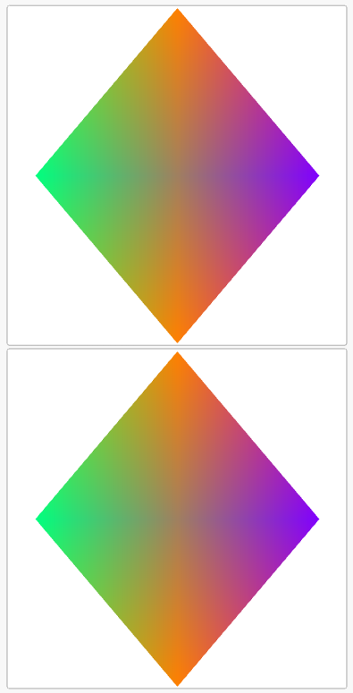

## 先从简单的 Hello, world. 开始

我假定你有一些 fltk-rs 或 gtk-rs 基础，不然一点点解释太累了。

```Rust
use eframe::egui;
fn main() {
    let native_options = eframe::NativeOptions::default();
    eframe::run_native(
        "My egui App",
        native_options,
        Box::new(|cc| Box::new(MyEguiApp::new(cc))),
    ).unwrap();
}
#[derive(Default)]
struct MyEguiApp {}
impl MyEguiApp {
    fn new(cc: &eframe::CreationContext<'_>) -> Self {
        Self::default()
    }
}
impl eframe::App for MyEguiApp {
    fn update(&mut self, ctx: &egui::Context, frame: &mut eframe::Frame) {
        egui::CentralPanel::default().show(ctx, |ui| {
            ui.heading("你好世界 Hello World!");
        });
    }
}
```

重点在于 `run_native(app_name, native_options, app_creator)` 这个函数，其中 `NativeOptions::default()` 表示我们运行的是桌面原生应用，egui/eframe同样支持WASM应用开发。
后面的 update 就是render时的更新，每帧都会有一次。我们在其中创建了一个 CentralPanel 也就是在正中显示的面板（侧面的有 SidePanel::left/right 和 TopBottomPanel::top/bottom），然后设置了标题级别文字。最终显示如下


Unicode 不能显示，英文正常。

## 加入一些新元素

将结构体改为
```Rust
struct MyEguiApp {
    frames: u64,
}
impl MyEguiApp {
    fn new(cc: &eframe::CreationContext<'_>) -> Self {
        Self { frames: 0 }
    }
}
impl eframe::App for MyEguiApp {
    fn update(&mut self, ctx: &egui::Context, frame: &mut eframe::Frame) {
        egui::CentralPanel::default().show(ctx, |ui| {
            ui.heading("你好 Hello World!");
            ui.horizontal(|ui| {
                for i in 0..10 {
                    if ui.button(format!("Button {i}")).clicked() {
                        ui.heading(format!("Button {i} clicked"));
                        if i == 0 {
                            ctx.set_visuals(egui::Visuals::dark());
                        } else if i == 1 {
                            ctx.set_visuals(egui::Visuals::light());
                        }
                    }
                }
            });
            ui.label(self.frames.to_string());
            self.frames += 1;
            if ui.input(|k| k.key_pressed(egui::Key::Escape) || k.key_pressed(egui::Key::Backspace)) {
                std::process::exit(0);
            }
        });
    }
}
```

frames 记录渲染更新的帧数，我们发现只有当鼠标移动时，才会重新渲染，否则它连变都不变。
然后当前两个按钮按下之后，在深色和浅色模式间切换，但是新显示的文字只会显示一帧，这就是即时模式，每一次渲染都是重新计算的。
然后 ui.horizontal 将布局变为水平。
最下方的 input 方法检测键盘按键。


## 输入输出与中文

输入输出可以使用 `TextEdit::singleline(str)` 来实现，其中的 str 会先打印出来，然后根据键盘输入反馈修改 str 的内容。
具体如下：
```Rust

impl eframe::App for MyEguiApp {
    fn update(&mut self, ctx: &egui::Context, _frame: &mut eframe::Frame) {
        egui::CentralPanel::default().show(ctx, |ui| {
            ui.heading("你好中文");
            ui.label(self.frames.to_string());
            for str in &mut self.strs {
                ui.horizontal(|ui| {
                    if *str != "".to_string() {
                        ui.add(egui::TextEdit::singleline(str).hint_text("张三"));
                        ui.label("你好 ".to_string() + str);
                    } else {
                        ui.add(egui::TextEdit::singleline(str).hint_text("张三"))
                            .on_hover_text("请输入姓名");
                        ui.label("等待输入");
                    }
                });
            }
            if ui.input_mut(|k| k.consume_key(egui::Modifiers::CTRL, egui::Key::D)) {
                self.strs.pop();
            }
            if ui.input_mut(|k| k.consume_key(egui::Modifiers::CTRL, egui::Key::N)) {
                self.strs.push(String::from(""));
            }
        });
        self.frames += 1;
    }
}
```
显示中文需要加载字体，这里使用了 fonts.font_data.insert 来新增一种字体，然后 include_bytes! 宏将文件内容在编译时转为二进制数据，直接输入给函数。
下面两行分别将我们的字体加载到了 Proportional 开头和 Monospace 的末尾。
```Rust
fn load_fonts(ctx: &egui::Context) {
    let mut fonts = egui::FontDefinitions::default();
    fonts.font_data.insert(
        "font_key".to_owned(),
        egui::FontData::from_static(include_bytes!("../assets/AlibabaPuHuiTi-2-55-Regular.otf")),
    );
    fonts
        .families
        .get_mut(&egui::FontFamily::Proportional)
        .unwrap()
        .insert(0, "font_key".to_owned());
    fonts
        .families
        .get_mut(&egui::FontFamily::Monospace)
        .unwrap()
        .push("font_key".to_owned());
    ctx.set_fonts(fonts);
}
```


## 动态加载图像

首先我们要在 Cargo.toml 中引入依赖 `egui_extras` ，然后在结构体初始化时加载图像加载器 `egui_extras::install_image_loaders(&cc.egui_ctx)` ，最后在 UI 中使用 `ui.image(path/url)` 来加载图像。

代码示例如下：

```Rust
struct MyEguiApp {
    imgn: i32,
}
impl MyEguiApp {
    fn new(cc: &eframe::CreationContext<'_>) -> Self {
        egui_extras::install_image_loaders(&cc.egui_ctx);
        Self { imgn: 0 }
    }
}
impl eframe::App for MyEguiApp {
    fn update(&mut self, ctx: &egui::Context, frame: &mut eframe::Frame) {
        egui::CentralPanel::default().show(ctx, |ui| {
            if ui.button("Next Image").clicked() {
                self.imgn = if self.imgn > 6 { 0 } else { self.imgn + 1 };
            }
            ui.image(format!("file://assets/ferris{}.png", self.imgn));
        });
    }
}
```

最终样貌如下：


## 更多内容

egui的各种特性都可以在! [这个网页上](https://www.egui.rs/#Demo)找到，而且附带源代码可供参考。因此，我们不需要更多的教程了。下面先尝试几个简单的特性，就可以直接开始游戏开发了。


# 特性测试
! [@important](同时也是游戏渲染器开发积累)

## UI overlap

```Rust
use eframe::egui;
use std::process;
mod tools_func;

fn main() {
    let mut native_options = eframe::NativeOptions::default();
    native_options.centered = true;
    eframe::run_native(
        "UI OverLap",
        native_options,
        Box::new(|cc| Box::new(MyEguiApp::new(cc))),
    )
    .unwrap();
}

struct MyEguiApp {
    show_immediate_viewport: bool,
}
impl MyEguiApp {
    fn new(cc: &eframe::CreationContext<'_>) -> Self {
        egui_extras::install_image_loaders(&cc.egui_ctx);
        tools_func::load_fonts(&cc.egui_ctx);
        Self {
            show_immediate_viewport: false,
        }
    }
}
impl eframe::App for MyEguiApp {
    fn update(&mut self, ctx: &egui::Context, _frame: &mut eframe::Frame) {
        let wind = egui::Window::new("Test window")
            .resizable(false)
            .default_rect(egui::Rect {
                min: egui::Pos2 { x: 300.0, y: 200.0 },
                max: egui::Pos2 { x: 500.0, y: 300.0 },
            });
        wind.show(ctx, |ui| {
            let _ = ui.button("ClickMe1");
            ui.group(|ui| {
                let _ = ui.button("ClickMe2");
                ui.checkbox(
                    &mut self.show_immediate_viewport,
                    "Show immediate child viewport",
                );
            });
        });

        let layout_layer0 = egui::containers::Frame {
            fill: egui::Color32::from_rgb(241, 233, 218),
            ..Default::default()
        };
        let layout_layer1 = egui::containers::Frame {
            fill: egui::Color32::from_rgba_unmultiplied(0, 0, 0, 0),
            ..Default::default()
        };

        egui::CentralPanel::default()
            .frame(layout_layer0)
            .show(ctx, |ui| {
                ui.group(|ui| {
                    for i in 0..10 {
                        ui.push_id(i, |ui| {
                            ui.label(
                                egui::RichText::new("Back Ground Layer")
                                    .color(egui::Color32::from_rgba_unmultiplied(0, 255, 0, 128)),
                            )
                        });
                    }
                });
            });
        egui::CentralPanel::default()
            .frame(layout_layer1)
            .show(ctx, |ui| {
                if ui.input(|k| k.key_pressed(egui::Key::Escape)) {
                    process::exit(0);
                }
                // egui::Frame::default().fill(egui::Color32::from_rgba_unmultiplied(r, g, b, a)).show( add_contents);
                egui::Frame::none()
                    .fill(egui::Color32::from_rgba_unmultiplied(255, 0, 0, 50))
                    .show(ui, |ui| {
                        ui.label("Frames cannot overlap");
                    });

                ui.put(
                    egui::Rect::from_min_size(
                        egui::Pos2 { x: 0.00, y: 30.0 },
                        egui::Vec2 { x: 50.0, y: 30.0 },
                    ),
                    egui::Label::new("Label fix 放在固定位置的 Label"),
                );
            });
        if self.show_immediate_viewport {
            ctx.show_viewport_immediate(
                egui::ViewportId::from_hash_of("immediate_viewport"),
                egui::ViewportBuilder::default()
                    .with_title("Immediate Viewport")
                    .with_inner_size([200.0, 100.0]),
                |ctx, class| {
                    egui::CentralPanel::default()
                        .frame(egui::containers::Frame {
                            fill: egui::Color32::from_rgba_unmultiplied(0, 0, 0, 0),
                            ..Default::default()
                        })
                        .show(ctx, |ui| {
                            ui.label("Hello from immediate viewport");
                        });
                    if ctx.input(|i| i.viewport().close_requested()) {
                        self.show_immediate_viewport = false;
                    }
                },
            );
        }
    }
}
```
效果如下：


首先，各大框架都不能指定固定位置，只有实现 Widget 的小部件才能通过 `ui.put(Rect, Widget)` 来指定位置。
**如果想要多层，需要多个 `egui::CentralPanel::default()` 同时出现，并将上层的设置为半透明，来满足上下叠加的层次。**
然后，`egui::Window::new("Test window")` 只会建立一个新的视窗，窗口的位置一定被置于最上面，因此也不能用来实现浮动显示。
最后，`ctx.show_viewport_immediate(id, builder, viewport_cb)` 是创建的一个新的窗口，和原本的窗口关联性不强，而且我们可以看出，设置透明背景会导致它成黑色的。

## 半透明
UI 的透明度选项于 2 月 16 号更新到了 git 储存库中，但是最新发布版本 0.26.2 发布于 2 月 14 号。 所以... 你懂的，NMD 没有这个选项，官网上的示例倒是挺齐全的，就是我用不了。但不急，反正也用不到。

## Animation

~~明天再搞，我还要写作业。~~
Animate 有两种方式，其一是使用 `ui.input(|i| i.time)` 来获取时间，然后根据时间计算样式，一旦样式发生变化，会强制渲染器重绘场景。
另一种是使用 `ctx.animate_value_with_time(unique_id, target, time)` 来返回一个过渡的值，初次调用向其中传入一个原始值，之后当 target 更改时，会再 time 的时间内从原先的值变化到新值。

然后还有 Canvas 可以用于绘图。
见文件 ! [@file](src/bin/animate.rs)
见文件 ! [@file](src/bin/animation.rs)


## 渐变填充
> 希望可以不要用到 GL ，不然后面的部分都是 Opengl 大法了。

目前看来 Canvas 自带的绘图没法那么高级的绘制，而且从示例 ! [@file](src/bin/gradient.rs) 可以看出 glow 可以比较友好的插入代码中，而不需要通篇的 Unsafe.
因此我决定先写一个着色器。重点在于绘制四边形。
首先，我们考虑一个单位正方形 $(0,0),(1,0),(0,1),(1,1)$ 它的四个顶点对应四种不同的颜色 $c_{00},c_{10},c_{01},c_{11}$ ，然后对于矩形内部的任意位置 $(x,y)$ ，应当显示的颜色为 $c(x,y)=(1-x)(1-y)c_{00} + x(1-y)c_{10} + (1-x)yc_{01} + xyc_{11}$ ，也就是按比例分配颜色。


但问题是，Opengl 使用的三角形渲染，假设三角形三个顶点为 $A,B,C$ 三角形内部一点 $P$ ，则 $P$ 关于三角形 A,B,C 三个顶点的权重为 $\alpha,\beta,\gamma$ 满足：$\alpha A + \beta B + \gamma C = P \rArr \alpha CA + \beta CB = CP$ 这样能求出三个权重。然后根据权重来分配颜色为 $color = \alpha c1 + \beta c2 + \gamma c3$。
然后就出现了上面的情形，四个点颜色一致，但是一个是上下两个三角形，一个是左右两个三角形，但绘制结果差别挺大的。
我们需要找到一种方式，将三角形渲染的结果等效为正方形，而不是上下两个三角形拼接的结果。
考虑最左侧的直角三角形，它的颜色需要满足 $(1-x-y)c_{00}+(y-x)c_{01}+2x(c_{00}+c_{10}+c_{01}+c_{11})/4 = c(x,y)$ 明显从x y的次幂上看不满足。

因此我们只能想办法找一种近似的算法来完成着色。
用 Blender 渲染出来的颜色如下所示，没有那么的鲜艳，但是能看出混合的效果还是很均匀的，唯一的问题就是，中心位置的颜色的饱和度很低，但这似乎也是我们可以接受的。


所以在调试了几次之后我发现，一个可行的方案是，
第一遍绘制正常的颜色，按水平/垂直分割三角形。第二遍绘制时，全部颜色（rgba）取1/2值，按垂直/水平分割三角形。两次叠加的效果正好近似于混合（如下所示）。这是因为两种顺序的渲染都是同样的效果，说明我们的叠加是**平衡的**。


## 纹理填充

用 OpenGL 的纹理填充，以及使用Ui的半透明背景。

### Ui 图像背景填充

这个倒是挺容易的，直接就有方法 Button::image(img) 来创建含背景的按钮。
然后我们在 `ui.add(btn3)` 之后就可以直接创建点击功能。
```Rust
let img = egui::Image::new(format!("file://assets/ferris{}.png", self.imgn)).max_height(100.0);
let btn3 = egui::Button::image(img)
    .fill(egui::Color32::TRANSPARENT)
    .frame(false);
let btn3 = ui.add(btn3);
if btn3.clicked() {
    self.imgn = if self.imgn < 1 { 6 } else { self.imgn - 1 };
}
btn3.on_hover_text_at_pointer("Previous Image");
```

但是，这种方法没有对应的文字，因此我们应当创建一个img，在img位置绘制文本，最后为这个图像添加交互事件。
```Rust
let img = ui.add(
    egui::Image::new(format!("file://assets/ferris{}.png", self.imgn)).max_height(50.0),
);
ui.painter().text(
    img.rect.center(),
    egui::Align2::CENTER_CENTER,
    "点我",
    egui::FontId {
        size: 20.0,
        family: egui::FontFamily::Proportional,
    },
    egui::Color32::BLUE,
);
if img.interact(egui::Sense::click()).clicked() {
    println!("Clicked");
}
```


### Opengl 背景填充

之后用到再说。

## 正交投影伪三维

一个投影矩阵加一个转动矩阵就ok了，如下：
```Rust
let colors = [
    0.0, 1.0, 0.5, 1.0, /* Left */
    1.0, 0.5, 0.4, 1.0, /* Top */
    1.0, 0.5, 0.0, 1.0, /* Bottom */
    0.5, 0.0, 1.0, 1.0, /* Right*/
];
let points = [
    0.7,  0.0, 0.0, // Left
    0.0,  0.7, 0.0, // Top
    0.0, -0.7, 0.0, // Bottum
   -0.7,  0.0, 0.0, // Right
];
let proj = [
    angle.cos(),    0.0,    -angle.sin(),
    0.0,            1.0,    0.0,
    angle.sin(),    0.0,    angle.cos(),
];
```
```GLSL
const int permutation[4] = int[4](1, 0, 3, 2);
const highp float zRatio = -0.1;
const highp float zoffset = 0.001;
const mat3x3 pj = mat3x3(0.866025,  -0.5,   zRatio,
                         0.0,       1.0,    zRatio,
                         -0.866025, -0.5,   zRatio
);
out vec4 v_color;
uniform int u_order;
uniform mat4 u_colors;
uniform mat4x3 u_points;
uniform mat3 u_proj;
void main() {
    if (u_order % 2 == 0) {
        v_color = u_colors[gl_VertexID];
        gl_Position = vec4(pj * u_proj * u_points[gl_VertexID], 1.0);
    } else {
        v_color = u_colors[permutation[gl_VertexID]] * 0.5;
        gl_Position = vec4(pj * u_proj * u_points[permutation[gl_VertexID]], 1.0);
        gl_Position.z += zoffset;
    }
}
```

然后会以类似如下的坐标框架显示（图中的 Z 对应着我们程序里的 Y 轴，而图中的 -Y 对应着我们程序里的 Z 轴）


## 三维前后关系

md 见鬼了，Depth Test 完全没效果，谁先 draw 谁在下层，后draw的完全不会discard。
我终于找到原因了，害的我研究了一晚上。

> 因为我们不用，所以干脆默认就不能用，欸嘿。

欸嘿你个头，我查了多少资料才发现的，害我一直以为 glow 有 Bug 了。感谢这两位仁兄，! [@link](https://github.com/emilk/egui/discussions/937#discussioncomment-1768955:~:text=used%20set%20the-,depth%20buffer,-to%200%20bits)(@text:它只说了要加 depth bits) 和 ! [@link](https://github.com/emilk/egui/discussions/2599#discussioncomment-4698327:~:text=add%20this%20option)(@text:它给出了问题的解决方法)

然后我们可以循环角度，这样就能同时渲染出多个有层次关系的面。
其中还有一个小技巧，由于我们开启了深度缓冲，每个面都需要着色两次，一次打底，一次半透明，若深度相同会导致图像重叠，出现深度冲突的典型特征——三角锯齿。因此我们还有一个小小的 `zoffset` 默认向前移动了 0.001 ，这样保证第二次能通过深度测试。
最终效果如下：


## Clip

其实也可以叫做遮罩效果。! [@link](https://blog.csdn.net/jaryguo/article/details/52627151)(@text:参见这篇CSDN博客)。
GL_SCISSOR_TEST 是有这样的功能，但是这个只能剪裁矩形区域，因此，我决定在 shader 中加入剪裁功能。

我们目前的剪裁逻辑如下，任意给定空间的一条直线，（姑且先通过点和一个线段得到），然后这条空间直线会确定一个投影平面的一条二维射线 $Ax+By+C=0$ ，然后我们根据这条射线，剪切掉它左侧的部分。
这里有一个简单的思路，我们将点到这条射线的距离作为参数录入顶点着色器，左侧为负，右侧为正，然后在片段着色器内根据距离舍弃小于 0 的部分。
着色器代码如下：

```GLSL
const int permutation[4] = int[4](1, 0, 3, 2);
const highp float zRatio = -0.1;
const highp float zoffset = 0.001;
const mat3x3 pj = mat3x3(0.866025, -0.5, zRatio,  // x -> x'
                         0.0, 1.0, zRatio,        // y -> y'
                         -0.866025, -0.5, zRatio  // z -> z'
);

out vec4 v_color;
out highp float mask_dist;

uniform bool u_base_layer;
uniform mat4 u_colors;
uniform mat4x3 u_points;
uniform mat3 u_proj;

uniform bool u_use_mask;
uniform vec3 u_mask_pos;
uniform vec3 u_mask_dir;

void main() {
  mat3 view = pj * u_proj;
  if (u_base_layer) {
    v_color = u_colors[gl_VertexID];
    gl_Position = vec4(view * u_points[gl_VertexID], 1.0);
  } else {
    v_color = u_colors[permutation[gl_VertexID]] * 0.5;
    gl_Position = vec4(view * u_points[permutation[gl_VertexID]], 1.0);
    gl_Position.z += zoffset;
  }
  if(u_use_mask){
    vec2 p = (view * u_mask_pos).xy;
    vec2 d = (view * u_mask_dir).xy;
    mask_dist = d.y * gl_Position.x - d.x * gl_Position.y + (p.y * d.y - p.x * d.x);
  }else{
    mask_dist = 1.0;
  }
}
```
```GLSL
in vec4 v_color;
in highp float mask_dist;
out vec4 out_color;
void main() {
  if (mask_dist < 0.0) {
    discard;
  }
  out_color = v_color;
}
```
而在 Rust 中，我们使用了glm 库，以便于矩阵计算。但目前 glm 库很不完整，不是很好用。

红色的裁剪线如下，右侧没有什么能保留的。


## 全屏模式下，背景使用 OpenGL ，上层的UI照常绘制。

将 main.rs 调整为现在这种状态。
同时，我还加入了性能监视器。（这是1000个正方形，带裁剪，在全屏模式(2K)下的渲染效果）


## Infinifold

最后，我们将这些特性打包集成好，输入一些四边形以及它们的顶点位置和颜色，自动在图中渲染出来。(这一步得等到正式开始游戏开发时再调整)

下一步工作就是将这个粗糙的 rust 草案迁移到游戏的开发目录下。